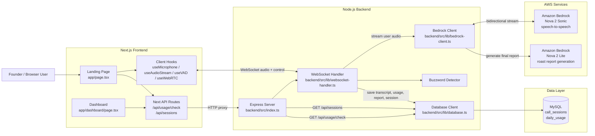

# PitchRoast AI Architecture

## System Diagram

## Request Flow

1. User browser frontend se microphone permission leta hai aur audio capture start hota hai.
2. Frontend WebSocket ke through backend ko PCM audio chunks bhejta hai.
3. Backend `WebSocketHandler` live session manage karta hai aur audio Amazon Bedrock Nova 2 Sonic ko stream karta hai.
4. Bedrock se AI voice response aur transcript events wapas aate hain, jo frontend mein playback hote hain.
5. Backend token usage, transcript, roast report, aur session metadata MySQL mein store karta hai.
6. Dashboard aur usage checks frontend ke Next.js API routes ke through backend REST endpoints se data fetch karte hain.

## Main Components

- Frontend: session start/end, mic access, audio playback, VAD, dashboard UI
- Backend: Express REST APIs, WebSocket session orchestration, Bedrock streaming, buzzword interruption logic
- AI layer: Nova 2 Sonic for live call experience, Nova 2 Lite for post-call roast report
- Data layer: MySQL for session history and daily token usage tracking
